# Pi Engineering — Native vs Blackhole A/B Benchmark

Generated: 2026-09-13T21:07:49.862Z

> METHODOLOGY NOTE: This benchmark runs a **deterministic, model-free simulator** that
> models the observable effect of session memory (recall reduces recomputed context;
> repeated tasks reuse prior memory). It does NOT run live model inference. Its purpose
> is to validate the measurement pipeline (metrics, raw-data retention, plots, report)
> and to make the expected direction of effect visible and reproducible. Real-model
> numbers can be substituted by supplying a `simulate` callback that feeds actual
> worker telemetry into `runExperiment`. The simulator's advantage is a modeling
> assumption, not a measured claim.

## Conditions

- **native**: engineering runtime without session memory (baseline).
- **blackhole**: runtime with per-session Blackhole memory enabled.

## Summary

```
[native] runs=11
  duration ms=1475 ctx=3933 in=3933
  toolCalls=2.8 turns=1.8 quality=0.86
  efficiency=0.22
[blackhole] runs=11
  duration ms=1348 ctx=3191 in=3191
  toolCalls=2.5 turns=1.6 quality=0.90
  recall rate=89.2% efficiency=0.28
```

## Relative improvement (blackhole over native)

| Metric | Native | Blackhole | Δ |
| --- | --- | --- | --- |
| context tokens | 3933 | 3191 | -18.9% |
| context efficiency | 0.22 | 0.28 | 28.7% |
| quality | 0.860 | 0.898 | 4.4% |
| duration (ms) | 1475 | 1348 | -8.6% |
| recall rate | 0.0% | 89.2% | — |

> Δ = percent change from native to blackhole (negative = reduction/improvement for context/duration;
> positive = gain for efficiency/quality).

## Plots

### Context tokens per run


### Recall rate per run

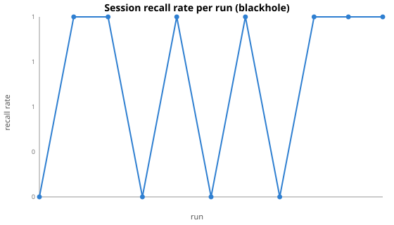

### Input tokens per run

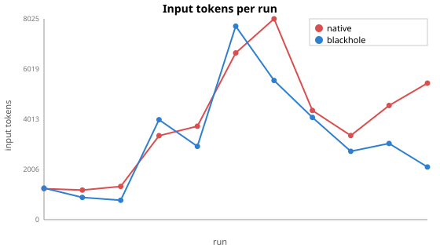

### Duration per run

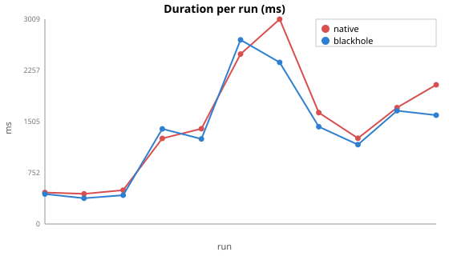

### Quality per run

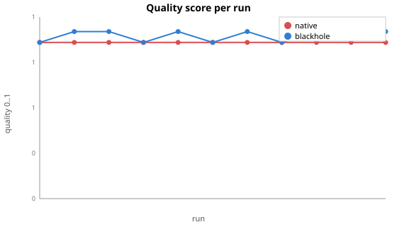

### Autonomy per run

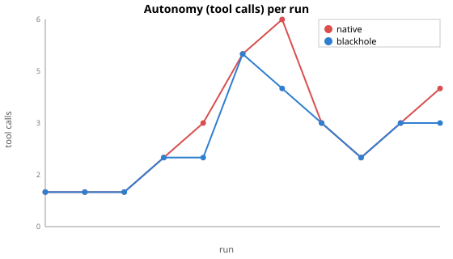

### Session entries per run

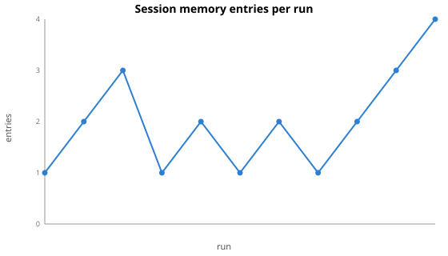

### Compactions per run

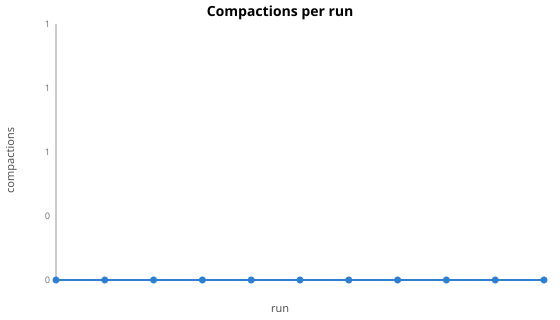

### Context efficiency

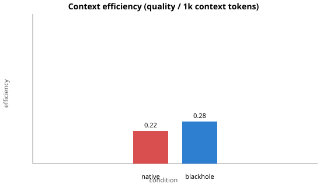

### Recall rate by condition

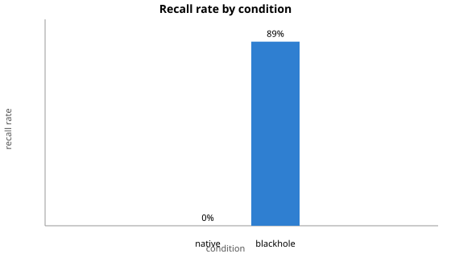

### Throughput

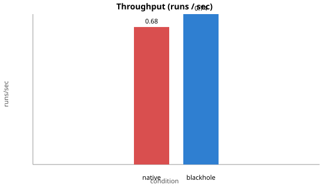

### Quality by condition

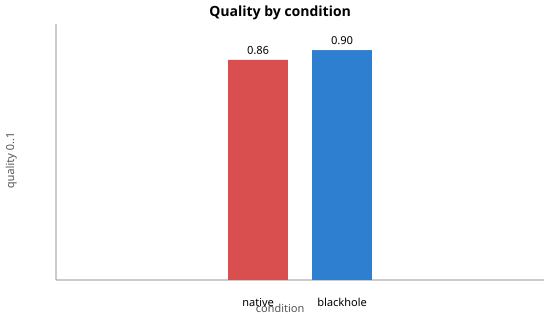

## Raw data

- JSONL: `raw.jsonl`
- CSV: `raw.csv`

> Raw data is preserved exactly (no aggregation loss) for re-analysis.