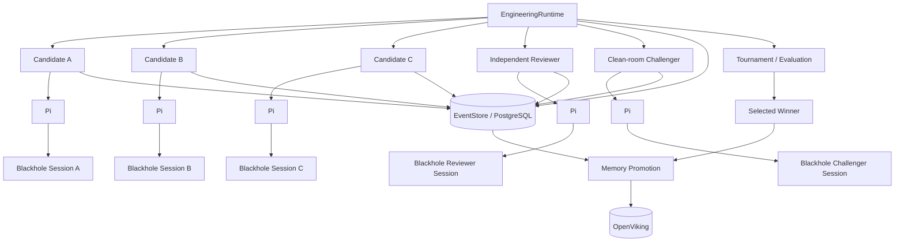
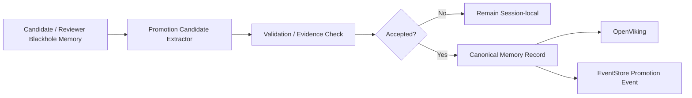

# Pi Harness Blackhole Integration Specification

**Project:** Local Pi Engineering Harness  
**Feature:** `pi-blackhole` session-memory integration  
**Status:** Implementation-ready  
**Initial validated target:** `pi-blackhole` 0.5.4, pinned rather than floating on `latest`  
**Primary goal:** Improve long-running Pi engineering sessions without weakening tournament isolation, reviewer independence, or the harness's authoritative event history.

---

## 1. Executive Summary

Integrate `pi-blackhole` into the local Pi engineering harness as a **per-session working-memory and context-recovery layer**.

Blackhole must **not** become the authoritative engineering record and must **not** directly become the shared cross-session project memory.

The intended memory hierarchy is:

1. **Blackhole** — local, per-Pi-session working memory and recall.
2. **Engineering EventStore / PostgreSQL** — authoritative execution history and system-of-record.
3. **OpenViking** — promoted, durable, cross-session / cross-machine engineering memory.

The harness must keep tournament candidates, reviewers, challengers, and other workers isolated. Memory from losing or speculative candidate branches must not automatically contaminate shared project memory.

The integration must be measurable. The harness must support controlled **Blackhole vs native-Pi A/B experiments**, record telemetry, and generate plots showing whether Blackhole improves engineering quality over long sessions and repeated compactions.

---

## 2. Goals

### 2.1 Functional goals

The system SHALL:

- Enable Blackhole independently for any Pi worker/session.
- Preserve candidate, reviewer, and challenger memory isolation.
- Pin the Blackhole package version/configuration used by each run.
- Allow Blackhole Observer, Reflector, and Dropper work to use separate lower-cost models.
- Prevent Blackhole background work from starving interactive or active engineering workloads.
- Expose Blackhole-related telemetry through the existing durable event ledger.
- Support memory promotion from completed/accepted engineering work into OpenViking.
- Prevent rejected/speculative candidate observations from entering durable shared memory automatically.
- Support A/B benchmarks comparing native Pi against Pi + Blackhole.
- Generate benchmark plots automatically.
- Keep the integration optional and backward-compatible.

### 2.2 Quality goals

The system SHOULD improve or maintain:

- final task success rate,
- tests passed,
- reviewer score,
- decision retention after compaction,
- recall accuracy,
- repeated-work rate,
- token efficiency,
- context-window utilization,
- long-session stability.

Blackhole MUST NOT be considered successful solely because it reduces token usage. The primary success criterion is preservation or improvement of engineering quality as sessions become long and compaction occurs repeatedly.

---

## 3. Non-Goals

This work SHALL NOT:

- replace EventStore/PostgreSQL,
- replace OpenViking,
- make Blackhole memory globally shared,
- merge candidate memories during tournament execution,
- allow one candidate to inspect another candidate's Blackhole state,
- allow implementation memory to silently bias an independent reviewer,
- require multiple inference providers,
- make Blackhole mandatory for all Pi sessions,
- automatically promote every Blackhole observation to shared memory,
- allow an unpinned `latest` package to silently roll out fleet-wide.

---

## 4. Architectural Model



### 4.1 Responsibility boundaries

| Layer | Responsibility | Authoritative? | Shared? |
|---|---|---:|---:|
| Blackhole | Session-local context retention, recall, observations, reflections | No | No |
| EventStore/PostgreSQL | Execution history, events, results, benchmark data | Yes | Yes |
| OpenViking | Curated reusable project knowledge | Durable knowledge | Yes |

---

## 5. Integration Principles

### 5.1 Session isolation

Every Pi execution SHALL receive a unique logical session identity.

Blackhole storage/state SHALL be scoped at least by:

- project/repository,
- engineering work item,
- worker role,
- tournament run,
- candidate/reviewer identity,
- Pi session.

Recommended identifier:

```text
{project}/{workItem}/{runId}/{role}/{workerId}/{sessionId}
```

Examples:

```text
inferweave/ISSUE-481/run-9/candidate/candidate-a/pi-7c91
inferweave/ISSUE-481/run-9/reviewer/reviewer-main/pi-d113
```

A worker MUST NOT load another worker's Blackhole session unless an explicit diagnostic/admin operation requests it.

### 5.2 Reviewer independence

Independent reviewers SHALL receive only the artifacts and evidence allowed by the existing review contract.

Blackhole MUST NOT be used as an implicit bridge from implementer session history into an independent reviewer session.

If review policy permits source-history retrieval, it must occur through an explicit, auditable handoff or evidence reference.

### 5.3 Clean-room challenger

The clean-room challenger SHALL start with its own Blackhole state.

It MUST NOT inherit:

- candidate observations,
- candidate reflections,
- candidate recalled transcript,
- candidate internal rationale.

It MAY receive project requirements and committed code according to existing challenger rules.

---

## 6. Blackhole Configuration

The harness SHALL expose a Blackhole configuration block.

Example:

```yaml
blackhole:
  enabled: true
  package:
    name: pi-blackhole
    version: "0.5.4"

  compaction:
    mode: auto
    engine: blackhole
    tailBehavior: pi-default

  memory:
    enabled: true
    sessionFallback: false

  workers:
    observer:
      provider: local
      model: fast-memory-model
      priorityClass: memory-background
    reflector:
      provider: local
      model: strong-memory-model
      priorityClass: memory-background
    dropper:
      provider: local
      model: fast-memory-model
      priorityClass: memory-background

  promotion:
    enabled: true
    automatic: false

  telemetry:
    enabled: true
```

### 6.1 Version policy

- Package version MUST be pinned.
- Run metadata MUST record the exact resolved package version.
- The harness MUST support an allowlist of validated Blackhole versions.
- Fleet rollout SHALL require an explicitly validated version.
- Upgrade tests SHALL execute before changing the default validated version.

### 6.2 Session-model fallback

Default:

```yaml
sessionFallback: false
```

Blackhole memory housekeeping SHOULD NOT automatically consume the active high-value coding/review model.

The configuration MAY allow fallback when explicitly enabled.

---

## 7. Model Routing for Memory Workers

Blackhole background agents SHALL use the same model-provider abstraction used by the rest of the harness.

Logical roles:

```text
blackhole.observer
blackhole.reflector
blackhole.dropper
```

Suggested policy:

| Role | Model class | Priority |
|---|---|---|
| Observer | fast / low-cost local | background |
| Reflector | stronger local reasoning | background |
| Dropper | fast / low-cost local | background |

The actual model must remain configurable and must not be hardcoded.

Fallback chains MAY be configured independently for each role.

Example:

```yaml
observer:
  models:
    - local/fast-a
    - local/fast-b

reflector:
  models:
    - local/reasoning-a
    - local/fast-a

dropper:
  models:
    - local/fast-a
```

---

## 8. Scheduler and Resource Priorities

Blackhole background computation SHALL participate in the harness scheduler.

Default priority order:

```text
P0  Owner / interactive user workload
P1  Active implementation candidate or reviewer
P2  Tests, evaluation, tournament scoring
P3  Blackhole Observer
P4  Blackhole Reflector / Dropper
```

### 8.1 Backpressure

When inference capacity is saturated:

- P0-P2 work continues first.
- Blackhole background tasks MAY queue.
- Memory processing MUST NOT cause active coding sessions to lose reserved inference capacity.
- Queued Blackhole tasks SHOULD expose waiting status in telemetry.
- A configurable maximum queue age SHOULD prevent stale background tasks from accumulating forever.

---

## 9. EventStore Integration

Blackhole-related activity SHALL be represented in the durable engineering ledger.

Recommended event types:

```text
blackhole.session.started
blackhole.session.stopped
blackhole.compaction.started
blackhole.compaction.completed
blackhole.compaction.failed
blackhole.observer.started
blackhole.observer.completed
blackhole.observer.failed
blackhole.reflector.started
blackhole.reflector.completed
blackhole.reflector.failed
blackhole.dropper.started
blackhole.dropper.completed
blackhole.dropper.failed
blackhole.recall.requested
blackhole.recall.completed
blackhole.recall.failed
blackhole.memory.promotion.proposed
blackhole.memory.promotion.accepted
blackhole.memory.promotion.rejected
blackhole.package.validation.started
blackhole.package.validation.completed
```

Events SHALL contain correlation fields as appropriate:

```json
{
  "projectId": "...",
  "workItemId": "...",
  "runId": "...",
  "sessionId": "...",
  "workerId": "...",
  "role": "candidate|reviewer|challenger|...",
  "candidateId": "...",
  "blackholeVersion": "...",
  "model": "...",
  "provider": "...",
  "timestamp": "...",
  "durationMs": 0,
  "status": "..."
}
```

Do not persist sensitive model secrets, access tokens, or provider credentials in these events.

---

## 10. Memory Promotion Pipeline

Blackhole memory remains session-local by default.

Shared durable knowledge SHALL enter OpenViking only through a promotion pipeline.



### 10.1 Promotion candidates

Eligible knowledge includes:

- accepted architectural decisions,
- confirmed defects and root causes,
- validated test discoveries,
- project constraints verified by source or execution,
- winning implementation rationale useful for future work,
- reviewer conclusions accepted by the engineering workflow,
- rejected approaches that are important enough to avoid repeating,
- known incompatibilities,
- stable build/test/runtime instructions.

### 10.2 Information not automatically promoted

Do not automatically promote:

- speculative candidate reasoning,
- unverified guesses,
- temporary debug observations,
- failed experiments without reusable value,
- redundant transcript text,
- raw chain-of-thought,
- unaccepted reviewer hypotheses,
- secrets or credentials.

### 10.3 Promotion status

Every promotion SHALL have:

```text
proposed
accepted
rejected
superseded
```

The accepted canonical record SHOULD retain evidence links to:

- EventStore events,
- commit/PR,
- test run,
- reviewer result,
- source artifact.

---

## 11. Tournament Integration

Each candidate receives:

```text
isolated worktree
+ isolated Pi session
+ isolated Blackhole state
+ shared task requirements
+ permitted project context
```

Candidate execution SHALL NOT merge Blackhole state.

When a tournament completes:

1. score candidates,
2. select winner according to existing tournament rules,
3. complete review/challenger process,
4. determine accepted engineering outcome,
5. extract reusable memory candidates,
6. validate promotion candidates,
7. persist approved knowledge to OpenViking,
8. leave non-approved candidate memory local/archived according to retention policy.

### 11.1 Losing candidates

A losing candidate's memory MAY still produce promoted knowledge if it discovered something independently valuable, such as:

- a confirmed failing edge case,
- a reproducible bug,
- an invalid approach future agents should avoid.

Promotion requires explicit evidence and acceptance.

Winning alone MUST NOT automatically make every observation trustworthy.

---

## 12. Recall Usage

The Pi worker MAY use Blackhole recall to recover information from its own session after compaction.

The harness SHOULD record:

- recall count,
- recall query type,
- recall latency,
- returned payload size,
- whether recall contributed to a subsequent successful action where measurable.

The harness MUST NOT depend on recall for authoritative state.

Anything required for correctness of orchestration must remain in EventStore/runtime state.

---

## 13. A/B Benchmark Framework

The integration SHALL include a repeatable experiment runner.

### 13.1 Experiment groups

Minimum:

```text
Control: native Pi
Treatment: Pi + Blackhole
```

Both groups SHALL receive equivalent:

- model/provider,
- task,
- starting repository state,
- resource limits,
- tool permissions,
- reviewer/evaluation policy.

### 13.2 Recommended task classes

Benchmarks SHOULD include:

- short tasks unlikely to compact,
- medium tasks,
- long tasks that compact at least once,
- very long tasks with repeated compactions,
- bug diagnosis,
- multi-file feature implementation,
- refactoring,
- test-driven repair,
- code-review follow-up,
- tournament candidate work.

### 13.3 Metrics

Capture at minimum:

```text
task_success
tests_passed
tests_failed
reviewer_score
challenger_score
wall_time
total_input_tokens
total_output_tokens
estimated_context_occupancy
compaction_count
recall_count
recall_latency_ms
repeated_work_events
lost_decision_events
files_touched
tool_calls
background_memory_calls
background_memory_gpu_time
background_memory_tokens
```

Derived metrics SHOULD include:

```text
success_per_1m_tokens
review_score_per_1m_tokens
quality_vs_compaction_count
quality_vs_context_occupancy
wall_time_overhead_percent
memory_background_cost_percent
recall_success_rate
repeat_work_reduction_percent
```

---

## 14. Required Plots

The benchmark/reporting system SHALL automatically generate plots.

At minimum:

1. **Reviewer score vs number of compactions**
2. **Task success rate vs number of compactions**
3. **Total tokens: native Pi vs Blackhole**
4. **Wall-clock time: native Pi vs Blackhole**
5. **Repeated-work events: native Pi vs Blackhole**
6. **Lost-decision events: native Pi vs Blackhole**
7. **Context occupancy over session time**
8. **Cumulative token usage over session time**
9. **Recall count and recall latency**
10. **Background Blackhole inference cost**
11. **Quality/cost frontier**
12. **Per-task paired comparison plot**

Reports SHALL retain underlying machine-readable data so plots can be regenerated.

Preferred artifact formats:

```text
JSONL / Parquet / CSV   benchmark data
PNG / SVG               generated plots
HTML or Markdown         benchmark summary
```

---

## 15. Quality-Degradation Experiment

One critical experiment SHALL explicitly test whether engineering quality degrades as compaction increases.

Example:

```text
reviewer score
100 |                         *
 90 |                    *
 80 |              *
 70 |        *
 60 |   *
    +-------------------------------
       0   1   2   3   4   5
           compaction count
```

Compare:

```text
native Pi quality slope
vs.
Pi + Blackhole quality slope
```

Primary hypothesis:

> Pi + Blackhole maintains a flatter quality-degradation curve across repeated compactions than native Pi.

This SHALL be one of the primary rollout gates.

---

## 16. Configuration Surface

The main harness configuration SHOULD support:

```yaml
engineering:
  memory:
    provider: blackhole

  blackhole:
    enabled: true
    version: "0.5.4"

    roles:
      candidate: true
      reviewer: true
      challenger: true
      planner: true
      documentation: true
      uiux: true

    compaction:
      mode: auto
      engine: blackhole

    observer:
      model: auto
    reflector:
      model: auto
    dropper:
      model: auto

    promotion:
      provider: openviking
      automatic: false

    benchmark:
      enabled: true
      recordRawMetrics: true
```

Individual roles MAY override defaults.

---

## 17. CLI / Operator UX

Add commands equivalent to:

```text
pi-harness blackhole status
pi-harness blackhole validate
pi-harness blackhole enable
pi-harness blackhole disable
pi-harness blackhole benchmark
pi-harness blackhole report
```

Optional useful commands:

```text
pi-harness blackhole sessions
pi-harness blackhole inspect <session>
pi-harness memory promotions
pi-harness memory approve <promotion>
pi-harness memory reject <promotion>
```

The exact command naming MAY follow existing project conventions.

### 17.1 Visible execution

Long-running commands SHALL stream visible progress.

The benchmark command MUST show:

- task being run,
- control/treatment assignment,
- candidate status,
- test status,
- reviewer status,
- compaction count,
- current metrics,
- generated report location.

Do not hide execution behind silent background processing.

---

## 18. Dashboard Integration

If the harness dashboard is present, add a Blackhole section.

Recommended panels:

- active Blackhole sessions,
- package version distribution,
- compactions/session,
- recall requests/session,
- Observer/Reflector/Dropper queue,
- memory worker GPU utilization,
- promotion proposals,
- A/B benchmark results,
- quality vs compaction chart,
- native-vs-Blackhole cost comparison.

Existing UI/UX validation requirements remain applicable.

---

## 19. Reliability Requirements

### 19.1 Failure behavior

If Blackhole fails:

- the Pi engineering task SHOULD continue when safe,
- the error SHALL be recorded,
- the harness SHALL surface degraded-memory status,
- the worker MAY fall back to native Pi compaction only if configured,
- the system MUST NOT corrupt EventStore state.

### 19.2 Package compatibility

Before enabling a new Blackhole version:

1. install in isolated test environment,
2. run package validation tests,
3. run representative Pi session,
4. force/observe compaction,
5. test recall,
6. test parallel sessions,
7. test tournament isolation,
8. test reviewer isolation,
9. test background model failure,
10. test graceful disable/fallback.

---

## 20. Security and Trust

Treat Pi packages as executable code.

Requirements:

- package versions SHALL be pinned,
- package updates SHALL be reviewed,
- package source/version SHALL be logged,
- secrets SHALL not be included in exported observations or promoted memory,
- filesystem permissions SHALL match the Pi worker sandbox,
- Blackhole SHALL receive no extra project permissions merely because it is a memory extension.

---

## 21. Rollout Plan

### Phase 1 — Adapter and configuration

Implement:

- package installation/version pin,
- harness configuration,
- session identity,
- start/stop lifecycle,
- event emission,
- enable/disable switch.

### Phase 2 — Memory-worker routing

Implement:

- Observer model routing,
- Reflector model routing,
- Dropper model routing,
- priority classes,
- scheduler backpressure.

### Phase 3 — Isolation validation

Verify:

- parallel candidate isolation,
- worktree isolation,
- reviewer isolation,
- challenger isolation,
- no cross-session leakage.

### Phase 4 — Memory promotion

Implement:

- promotion candidate schema,
- evidence links,
- approve/reject states,
- OpenViking provider integration,
- EventStore audit events.

### Phase 5 — Benchmarking

Implement:

- native vs Blackhole experiment runner,
- paired tasks,
- metrics capture,
- report generation,
- required plots.

### Phase 6 — Dashboard

Add:

- Blackhole status,
- queues,
- resource usage,
- promotions,
- benchmark visualization.

### Phase 7 — Default rollout

Only enable Blackhole by default after acceptance gates are met.

---

## 22. Acceptance Criteria

The feature is complete when all of the following are true.

### Core integration

- [ ] Blackhole can be enabled/disabled by configuration.
- [ ] Exact package version is pinned and recorded.
- [ ] Native Pi remains functional when Blackhole is disabled.
- [ ] Blackhole session lifecycle is integrated into EngineeringRuntime.
- [ ] Session state is isolated per worker.

### Tournament isolation

- [ ] Parallel candidates do not share Blackhole memory.
- [ ] Reviewer does not inherit candidate Blackhole memory.
- [ ] Challenger does not inherit candidate/reviewer Blackhole memory.
- [ ] Concurrent sessions do not corrupt each other's state.

### Scheduling

- [ ] Observer/Reflector/Dropper use configurable model routes.
- [ ] Session-model fallback defaults to disabled.
- [ ] Background memory work yields to P0-P2 workloads.
- [ ] Memory-worker queues and failures are observable.

### EventStore

- [ ] Blackhole lifecycle events are durable.
- [ ] Compaction events are durable.
- [ ] Recall events are durable.
- [ ] Promotion decisions are durable.
- [ ] Benchmark run metadata is durable.

### OpenViking

- [ ] Shared memory requires explicit promotion.
- [ ] Promotion records contain evidence.
- [ ] Speculative/raw candidate memory is not automatically promoted.
- [ ] Accepted promoted memories can be consumed by later sessions.

### Benchmarking

- [ ] Native Pi and Pi + Blackhole can run equivalent A/B tasks.
- [ ] Required metrics are collected.
- [ ] Required plots are generated automatically.
- [ ] Raw benchmark data is retained.
- [ ] Report can be regenerated from stored data.

### Quality

- [ ] Blackhole does not materially reduce short-task engineering quality.
- [ ] Long-session tests demonstrate equal or better reviewer scores than control.
- [ ] Quality-vs-compaction behavior is measured.
- [ ] Rollout decision is based on evidence rather than token savings alone.

### Engineering quality

- [ ] Unit tests pass.
- [ ] Integration tests pass.
- [ ] Concurrency tests pass.
- [ ] Failure/fallback tests pass.
- [ ] Documentation is updated.
- [ ] CLI help is updated.
- [ ] UI/dashboard, if changed, passes visual inspection.
- [ ] Repository is left clean and committed according to project conventions.

---

## 23. Suggested Test Matrix

| Test | Native Pi | Blackhole | Parallel | Reviewer | Failure injection |
|---|---:|---:|---:|---:|---:|
| Short implementation | ✓ | ✓ |  | ✓ |  |
| Long implementation | ✓ | ✓ |  | ✓ |  |
| Repeated compaction | ✓ | ✓ |  | ✓ |  |
| 3-way tournament |  | ✓ | ✓ | ✓ |  |
| 12-way tournament |  | ✓ | ✓ | ✓ |  |
| Reviewer isolation |  | ✓ | ✓ | ✓ |  |
| Blackhole worker outage |  | ✓ |  | ✓ | ✓ |
| Provider outage |  | ✓ | ✓ | ✓ | ✓ |
| Blackhole package disabled | ✓ |  |  | ✓ |  |
| Memory promotion |  | ✓ |  | ✓ | ✓ |

---

## 24. Deliverables

Implementation SHALL produce:

```text
src/...                       Blackhole adapter/integration
config/...                    Blackhole configuration
tests/...                     unit/integration/concurrency tests
benchmarks/...                A/B experiment runner
reports/...                   report generator
docs/...                      operator/developer documentation
```

Generated benchmark artifacts SHOULD resemble:

```text
artifacts/blackhole-benchmarks/<run-id>/
  metrics.jsonl
  metrics.csv
  summary.md
  reviewer-score-vs-compactions.png
  success-vs-compactions.png
  tokens-comparison.png
  wall-time-comparison.png
  repeated-work.png
  lost-decisions.png
  context-occupancy.png
  recall-latency.png
  memory-background-cost.png
  quality-cost-frontier.png
```

---

## 25. Definition of Done

This work is not complete when Blackhole merely installs.

It is complete when:

1. Blackhole is a first-class optional memory provider in the Pi engineering harness.
2. Candidate/reviewer/challenger session isolation is proven by automated tests.
3. Memory background workloads are routed and scheduled safely.
4. EventStore provides an auditable record of Blackhole activity.
5. Accepted engineering knowledge can be promoted into OpenViking without polluting shared memory with speculative candidate state.
6. Native Pi vs Pi + Blackhole can be benchmarked automatically.
7. The required plots and report are generated automatically.
8. The team has quantitative evidence about whether Blackhole improves long-running engineering sessions.
9. All tests, reviews, docs, and visual validation are complete.
10. The implementation is committed with a clean working tree.

